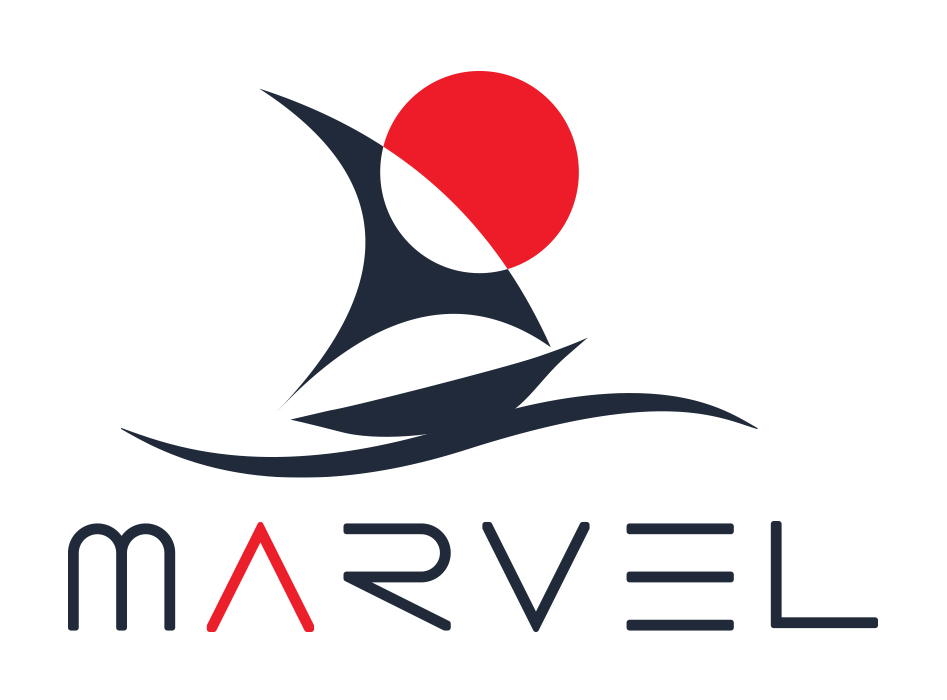

# The NASA Space Apps Challenge

The NASA Space Apps Challenge is coming to Adelaide 23-24th April, 2016.

The [NASA Space Apps Challenge 2016](https://2016.spaceappschallenge.org) is an international hackathon conducted in over 200 locations worldwide.

We invite engineers, coders, makers, artists entrepreneurs scientists and storytellers to connect over mission-related challenges, participating in NASA's Open Innovation Initiative. Together, citizens like you have developed thousands of open-source solutions. Your big ideas are shaped using data visualizations, hardware, code, design, even board games, and more!

If you are an individual thinking of [registering](https://2016.spaceappschallenge.org/locations/adelaide-australia) and need help forming or joining a team, please dont hesitate to contact us, either via Twitter [@SpaceAppsAdl](https://twitter.com/SpaceAppsAdl) or via email at adlspaceapp2016 AT phaze dot space !
   
There are challenges this year in the following categories:
* [Aeronautics](https://2016.spaceappschallenge.org/challenges/aero),
* [Space Station](https://2016.spaceappschallenge.org/challenges/space-station),
* [Solar System](https://2016.spaceappschallenge.org/challenges/solar-system),
* [Technology](https://2016.spaceappschallenge.org/challenges/tech),
* [Earth](https://2016.spaceappschallenge.org/challenges/earth),
* [Journey to Mars](https://2016.spaceappschallenge.org/challenges/mars)

Here in South Australia we like to put our own spin on things therefore in addition to the above, you are invited to tackle a special local challenge we have arranged in collaboration with [Associate Professor Graziella Caprarelli](http://www.unisanet.unisa.edu.au/staff/homepage.asp?Name=Graziella.Caprarelli), co-founder of [Marvel STEM](http://www.marvelstem.org/) and the Italian Osservatorio di Radioastronomia Istituto Nazionale di Astrofisica.

# The South Australian Challenge

_Note: this challenge is **NOT** eligible for progression to international judging_

MARVEL ([MARS Australian Remote Virtual Experiment Laboratory](http://www.marvelstem.org/)) is a virtual laboratory for students, teachers and scientists to study and analyse real-life planetary data from Mars-orbiting satellites. It allows students and teachers to experience authentic science and simultaneously progresses scientific discoveries about Mars. The MARVEL team now wants your help to develop a citizen science app so that anyone who wishes to can participate in this voyage of discovery!

We have a variety of algorithms for analysing the data. Presently these are coded in Matlab, and we would like assistance to improve this code and how it might be made more accessible  Examples include, converting the implementation into a Python library, using the code to make a game, or writing documentation or creating an Infographic, but we don't want to be too prescriptive so we can leave it up to your create imaginations!

Please read the [Challenge Background sheet](ChallengeBackground.md) for an briefing on the analysis to date.

# Stay Tuned

Further information, including judging criteria, will be released closer to the event.

# Links

* [Official international website : https://2016.spaceappschallenge.org](https://2016.spaceappschallenge.org)
* [Registration site & venue information](https://2016.spaceappschallenge.org/locations/adelaide-australia)
* [Twitter updates by @SpaceAppsAdl](https://twitter.com/SpaceAppsAdl)
